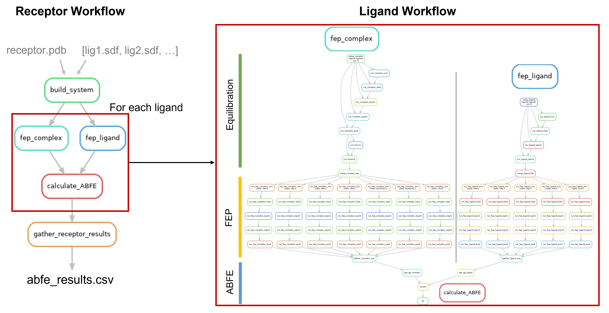

# ABFE_workflow
**WARNING**: **The repo is currently under development - No Guarantees at the moment. But will be soon at a first version. :)**

A snakemake based workflow for ABFE calculations using GMX. The workflow can be scaled on Slurm Queuing systems.
The here provided Cyclophilin D Test systems and experimental values originate from:
* [Alibay, I.; Magarkar, A.; Seeliger, D.; Biggin, P. C. Evaluating the use of absolute binding
free energy in the fragment optimisation process. Communications Chemistry 2022, 5,
105.](https://doi.org/10.1038/s42004-022-00721-4)
* [Grädler, U.; Schwarz, D.; Blaesse, M.; Leuthner, B.; Johnson, T. L.; Bernard, F.; Jiang, X.; Marx, A.; Gilardone, M.; Lemoine, H.; Roche, D.; Jorand-Lebrun, C. Discovery of novel Cyclophilin D inhibitors starting from three dimensional fragments with
millimolar potencies. Bioorganic Medicinal Chemistry Letters 2019, 29, 126717.](https://doi.org/10.1016/j.bmcl.2019.126717)

Here a visualization of the triggered process:



## New Features:
We are currently improving the user experience. The input was simplified to simply only the need of providing a pdb file for the receptor and .sdf files for the ligand.

```bash
>cli-abfe -h

usage: cli-abfe [-h] -p PROTEIN_PDB_PATH -l LIGAND_SDF_DIR -o OUTPUT_DIR_PATH [-c COFACTOR_SDF_PATH] [-nc NUMBER_OF_CPUS_PER_JOB] [-nj NUMBER_OF_PARALLEL_JOBS] [-nr NUMBER_OF_REPLICATES] [-submit]
                       [-gpu] [-hybrid]

optional arguments:
  -h, --help            show this help message and exit
  -p PROTEIN_PDB_PATH, --protein_pdb_path PROTEIN_PDB_PATH
                        Input protein pdb file path
  -l LIGAND_SDF_DIR, --ligand_sdf_dir LIGAND_SDF_DIR
                        Input ligand(s) sdf file path
  -o OUTPUT_DIR_PATH, --output_dir_path OUTPUT_DIR_PATH
                        Output approach folder
  -c COFACTOR_SDF_PATH, --cofactor_sdf_path COFACTOR_SDF_PATH
                        Input cofactor(s) sdf file path
  -nc NUMBER_OF_CPUS_PER_JOB, --number_of_cpus_per_job NUMBER_OF_CPUS_PER_JOB
                        Number of cpus per job
  -nj NUMBER_OF_PARALLEL_JOBS, --number_of_parallel_jobs NUMBER_OF_PARALLEL_JOBS
                        Number of jobs in parallel
  -nr NUMBER_OF_REPLICATES, --number_of_replicates NUMBER_OF_REPLICATES
                        Number of replicates
  -nosubmit             Will not automatically submit the ABFE calculations
  -nogpu                don't use gpus for the submissions?
  -nohybrid             don't do hybrid execution (complex jobs on gpu and ligand jobs on cpu (requires gpu flag))
```


## Usage: 
An example usage is provided with the `examples/example_execution.sh`, that uses the  `ABFE_Calculator.py` script.
If you remove the submit flag, you can a start a run, that only sets up the folder structure. (checkout our example folder)

Additional script information is provided via:
```bash
  conda activate abfe

  cli-abfe -h
  # or
  cli-abfe-gmx -h
```

Running an ABFE Campaign from Bash:
```bash
  conda activate abfe
  cli-abfe -p <path>/receptor.pdb \
           -l <path>/myligands \
           -o <path>/Out  \
           -nogpu -nohybrid -nc 8
```

### Input
The input is suggested to be structured as follows for the commandline option:
  * \<ligands\>
     * ligand1.sdf
     * ligand2.sdf
     * ligand3.sdf
     * ...
   * receptor.pdb

For the python call: 
 * ligand_sdfs:List[str] - paths to sdf files
 * protein_pdb_path: str - path to pdb file 

Alternativley you can provide gromacs input files and use the command line tool `ABFE_GMX_CLI`. Please make sure your ligand is called `LIG` in the gmx files. The input sturucture should look like this:
  * \<rooot_dir\>
    * \<ligand-1\>
      * solvent
        * solvent.gro
        * solvent.top
      * complex
        * complex.gro
        * complex.top
    * \<ligand-2\>
      * solvent
        * solvent.gro
        * solvent.top
      * complex
        * complex.gro
        * complex.top
        ...

### Install:
The package can be installed like the following script:
```
  cd ABFE_workflow
  conda env create --file ./environment.yml
  conda activate abfe
  pip install .
```

