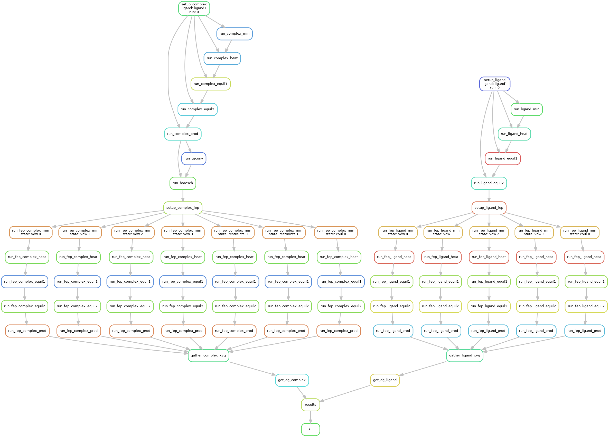

# ABFE_workflow

A snakemake based workflow for ABFE calculations using GMX. The workflow can be scaled on Slurm Queuing systems.


## Install:
You require the MDRestraintsGenerator package in your env to run this package.
The package can be be used with the provided environment:

```
  cd ABFE_workflow
  conda env create --file ./environment.yml
  conda activate abfe
  conda develop ${PWD}
```

## Usage: 
An example usage is provided with the `calc_ABFE.py` package.
### Input
The input needs to be structured as follows:
 -\<input_root_dir\>:
  * \<ligand name1\>
     * complex
        - complex.gro
        - complex.top
        - complex_ligand_posres.itp
     
     * ligand
       - ligand.gro
       - ligand.top
       - ligand_posres.itp
  
   * \<ligand name2\>
     * complex
       - complex.gro
       - complex.top
       - complex_ligand_posres.itp
     * ligand
       - ligand.gro
       - ligand.top
       - ligand_posres.itp
....

Please check, that the name of the small-molecule is LIG! For further guidance check the example folder in `data/input/CyclophilinD`.

### Running:
 if the input is set-up correctly, you can use the calc_ABFE.py script and modify the parameters accordingly to your needs and give it a run!
 make sure to set \<input_root_dir\> and `submit` to `True` if you directly want to go to the cluster, all ligands in `input_root_dir` will be scheduled then.


